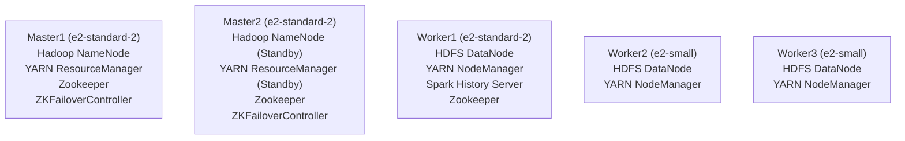

## GCP 5-Node Cluster Topology (Hadoop · Spark on YARN)

> 본 프로젝트는 **GCP Spot 인스턴스 + $300 크레딧**을 활용하여 5노드 클러스터로 운영합니다.
> (예: e2-standard-2 3대, e2-small 2대, 모두 Spot 인스턴스)

### 노드 구성 및 역할
<details>
<summary>Nodes & Roles</summary>

- **Master1** (e2-standard-2):
	- Hadoop NameNode 
	- YARN ResourceManager
	- Zookeeper
	- ZKFailoverController
- **Master2** (e2-standard-2):
	- Hadoop NameNode (Standby)
	- YARN ResourceManager (Standby)
	- Zookeeper
	- ZKFailoverController
- **Worker1** (e2-standard-2):
	- HDFS DataNode
	- YARN NodeManager
	- Spark History Server
	- Zookeeper
- **Worker2** (e2-small):
	- HDFS DataNode
	- YARN NodeManager
- **Worker3** (e2-small):
	- HDFS DataNode
	- YARN NodeManager
</details>


### 클러스터 구성도 (Mermaid)


```
