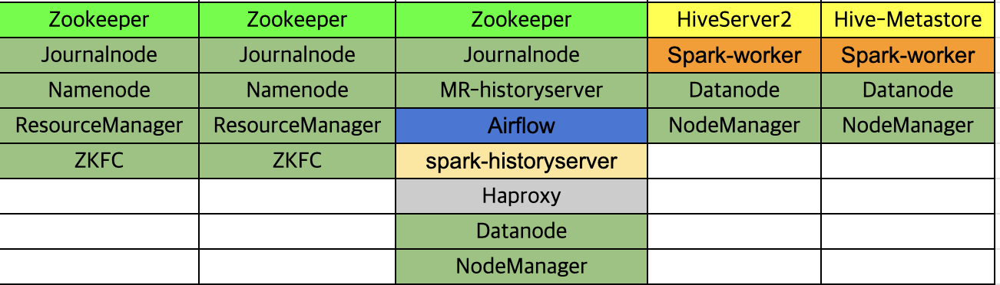

## 5-Node Cluster Topology (Hadoop · Hive · Spark · Airflow)

> 본 프로젝트는 **5대 구성**으로 운영합니다.(추후 무료인스턴스에 따라 바뀔수 있음.)

Nodes & Roles

- **M1** — Apache ZooKeeper, Apache Hadoop JournalNode, Apache Hadoop NameNode, YARN ResourceManager, ZKFailoverController  
- **M2** — Apache ZooKeeper, Apache Hadoop JournalNode, Apache Hadoop NameNode, YARN ResourceManager, ZKFailoverController  
- **C1** — Apache ZooKeeper, Apache Hadoop JournalNode, MapReduce JobHistory Server, Apache Airflow, Apache Spark History Server, HAProxy, HDFS DataNode, YARN NodeManager  
- **D1** — Apache HiveServer2, Apache Spark Worker, HDFS DataNode, YARN NodeManager  
- **D2** — Apache Hive Metastore (mysqlDB backend), Apache Spark Worker, HDFS DataNode, YARN NodeManager

