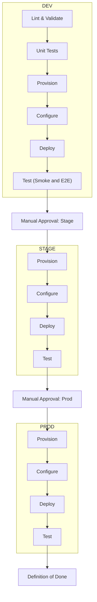

# Data Infra 설치 자동화 Workflow
- 크게 4단계로 나누어서 진행할 수 있음
    - Provision
    - Configure
    - Deploy
    - Test

## 집 짓기에 비유한 Data Infra 설치 자동화 4단계
```bash
[Provision]
 └ 땅을 다지고 뼈대를 세움
    (서버, 네트워크, 스토리지 생성)
        ↓
[Configure]
 └ 전기, 배관, 창문, 기본 설비 세팅
    (계정, 권한, OS, 공통 설정)
        ↓
[Deploy]
 └ 가구·가전 배치
    (Kafka, Trino, Spark 등 서비스 설치)
        ↓
[Test]
 └ 사람이 입주해서 불 켜고 물 틀어봄
    (Smoke Test, 쿼리 실행 검증)
```


## Data Infra 설치 자동화 Workflow


## Data Infra 설치 자동화 Workflow 상세
- dev -> stage -> prod 과정을 거쳐서 실 서비스까지 배포를 할 수 있는 구성
- 필요에 따라서 stage 는 건너뛰고, dev -> prod 까지만 해서 간소화 할 수 있습니다.
- 해당 project 에서는 dev 와 prod 까지만 고려해서 Infra 설치 자동화를 구성합니다.



## 용어 정리
- provisioning: Data Infra 를 설치할 기초 Resource 를 자동으로 생성하는 단계를 의미
- lint: IaaC 의 code 부분의 간단한 syntax 검사를 수행


### Provisioning
- Resource 할당 및 생성
- On-Premise 라면 Server 초기화(OS 설치, Network 설정, Partition/Storage mount 등) 까지 포함
- Cloud 라면 VM, VPC, Subnet, 보안그룹, S3/Storage Bucket 같은 Infra Resource 를 생성하는 것
- HDFS, Kafka, Trino 같은 Application Level 설치/구성은 하지 않음
- 단순히 Application 이 올라갈 뼈대(Server, Network, Storage) 만 준비
- 요약
    - 실행 환경(Server, Storage, Network) 을 자동화 도구로 생성하는 단계
    - 이후에 Configure (설정) 와 Deploy (배포) 단계를 거쳐서 실제 서비스가 실행됨

### 사용하는 도구 예시
- OpenTofu(Terraform), CloudFormation → Cloud Resource 생성
- Packer → 미리 설정된 OS Image(AMI, VM Template) 생성
- Kubernetes 클러스터 자체를 만드는 경우도 이 단계에 포함됨
